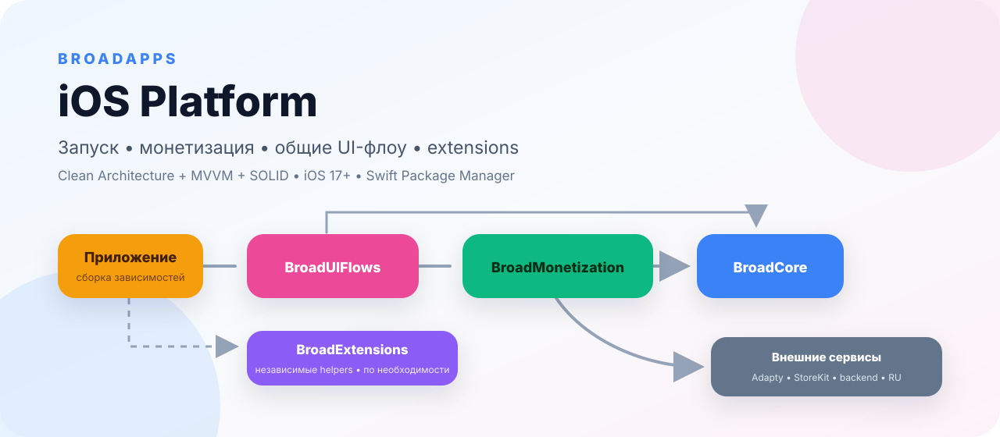
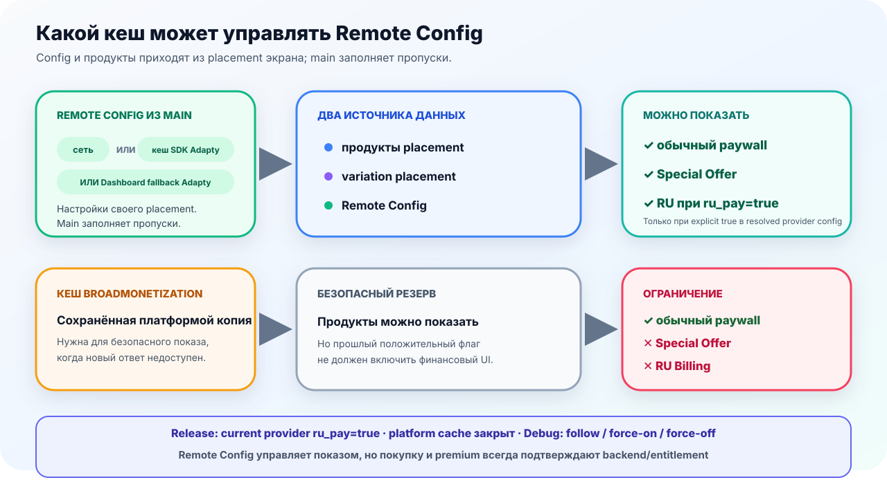
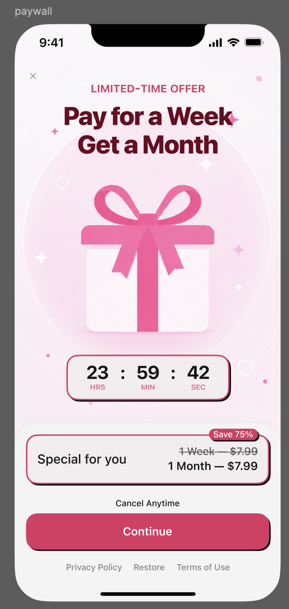

# BroadMonetization

<p align="center">
  <picture>
    <source media="(prefers-color-scheme: dark)" srcset="Documentation/Assets/README/hero-dark.svg">
    <source media="(prefers-color-scheme: light)" srcset="Documentation/Assets/README/hero-light.svg">
    
  </picture>
</p>

<p align="center">
  
  
  
  
</p>

Provider-neutral monetization-модуль BroadApps для paywall catalog,
Adapty/StoreKit adapters, entitlements, purchase/restore coordination, Special
Offer, RU Billing и safe analytics.

[Документация BroadApps iOS](https://broadapps-ios-docs.nkhsnv.chatgpt.site) ·
[Создание приложения](https://broadapps-ios-docs.nkhsnv.chatgpt.site/docs/app-creation) ·
[Changelog](CHANGELOG.md) ·
[Публичный API](Documentation/PublicAPI.md) ·
[Как предложить правку](CONTRIBUTING.md)

**Быстрый маршрут:** [установка](#installation) ·
[Adapty setup](#базовая-настройка-adapty) ·
[Special Offer](#special-offer-где-теперь-стоит-gate) ·
[RU Billing](#ru-billing) · [RU Special Offer](#спешл-оффер-ru-billing) · [tokens](#token-purchases-и-recovery) ·
[проверка](#проверка)

## Что делает модуль

- загружает paywall и все products в provider order без filter/sort/dedup;
- сохраняет exact raw-product reference для purchase;
- агрегирует server-authoritative entitlement sources и bounded cache;
- координирует purchase/restore/recovery без дублирования operations;
- применяет fail-closed gates для Special Offer и RU Billing;
- регистрирует dependencies через `BroadMonetizationAssembly`.

## Что модуль не делает

- не содержит готовые SwiftUI paywall/onboarding screens;
- не хранит app-owned keys, product IDs, placement IDs и backend URLs;
- не признаёт cache доказательством purchase или premium access;
- не запускает purchase, restore и RU payment в sandbox/gate;
- не зависит от `BroadUIFlows` или `BroadExtensions`.

## Product и dependencies

| Product | Platform | BroadApps dependency | External dependencies |
|---|---|---|---|
| `BroadMonetization` | iOS 17+, iPhone | compatible `BroadCore` from `1.0.0` | Adapty `3.17.3`, Swinject `2.10.0` |

Host app подключает этот repository только по надобности. Обязательного
umbrella package нет. Если app напрямую импортирует `BroadCore`, его product
тоже добавляется в app target.

## Installation

```swift
dependencies: [
    .package(
        url: "https://github.com/BroadApps-official/broad-monetization-ios.git",
        from: "1.0.0"
    )
]
```

## Базовая настройка Adapty

Реальные keys, product IDs и placement IDs принадлежат host app. Модуль хранит
typed contract и fallback policy, но не вшивает строки конкретного проекта.

Для обычного anonymous-приложения базовая настройка состоит из public SDK key и
placement mapping:

```swift
let adapty = AdaptyPlatformConfiguration(apiKey: appConfiguration.adaptyPublicKey)!
let placements = AdaptyPlacementRegistry(
    main: AdaptyPlacementID(rawValue: appConfiguration.mainPlacement),
    mappings: [
        .tokens: AdaptyPlacementID(rawValue: appConfiguration.tokensPlacement),
        .specialOffer: AdaptyPlacementID(rawValue: appConfiguration.specialOfferPlacement)
    ]
)

let factory = AdaptyMonetizationFactory(
    configuration: adapty,
    placementRegistry: placements,
    messages: appOwnedMessages
)
```

Access level и собственный `AdaptyIdentityProviderProtocol` для этого маршрута
не нужны. Они остаются advanced API только для приложения с собственной
signed-in identity или отдельным authoritative entitlement adapter.

| Что настраивается | Базовое правило для нового app |
|---|---|
| Product без trial | Командная naming convention — суффикс `nottrial` слитно, например `weekly_9.99_nottrial`; runtime на имя не полагается |
| Paywall names | `main`; опциональные `tokens` и `special_offer` только когда flow действительно нужен |
| Placement IDs | `onboarding`, `pro_icon`, `settings`, `main`, `CTR`, `special_offer`; дополнительные — из app specification |
| Fallback | Базовые placements связываются с paywall `main`; фактический fallback фиксируется в payload context |
| Products | `getPaywall → getPaywallProducts → 1:1 mapping → raw registry`; без filter/sort/dedup |

Пример payload для **нового приложения с выключенным Special Offer**:

```json
{
  "special_offer": false
}
```

Этот JSON нельзя копировать поверх действующего Dashboard: реальный payload и
его остальные поля принадлежат конкретному приложению.

<picture>
  <source media="(prefers-color-scheme: dark)" srcset="Documentation/Assets/README/remote-config-cache-flow-dark.svg">
  <source media="(prefers-color-scheme: light)" srcset="Documentation/Assets/README/remote-config-cache-flow-light.svg">
  
</picture>

## Special Offer: где теперь стоит gate

Претензия «блок идёт до парсинга подписок» закрыта явным pipeline:

```text
Adapty.getPaywall
  → Adapty.getPaywallProducts
  → mapping всего provider array без filter/sort/dedup
  → storage exact raw-product references
  → special_offer = true из загруженного payload
  → второй paywall
```

`ResolveSpecialOfferUseCase` получает уже целый `PaywallPayload` с products и
только после этого проверяет `special_offer = true`. Приложение не добавляет
в этот базовый flow verifier, второй REST transport или повторную загрузку.

24-часовой countdown — только visual loop
`24:00:00 → 00:00:00 → 24:00:00`; ноль не скрывает offer и не блокирует
purchase.

Никакого schedule, server clock или скрытого окна показа стандартный flow не
добавляет: единственный gate — `special_offer = true`, а таймер всегда является
циклической визуализацией на 24 часа. Динамический таймер остаётся отдельной
будущей задачей и не связан с правилами RU Billing.

<table>
  <tr>
    <td align="center" width="50%">
      
      <br><strong>1. Subscription paywall</strong>
      <br><sub>Close без confirmed purchase/restore</sub>
    </td>
    <td align="center" width="50%">
      
      <br><strong>2. Special Offer</strong>
      <br><sub>Только после resolver и explicit gate</sub>
    </td>
  </tr>
</table>

Скриншоты показывают **последовательность**, а не обязательный дизайн. Тексты,
изображения, число карточек и скидка остаются app-owned; цикл таймера задаёт
платформа.

## RU Billing

RU methods показываются, только если одновременно выполнены все условия:

1. host app зарегистрировал RU Billing adapters;
2. verified-fresh provider payload содержит `ru_pay = true`;
3. App Store storefront — `RU/RUS` **или** регион iPhone — `RU/RUS`;
4. RU catalog не пуст и точно сопоставлен выбранному product;
5. backend authorization/kill switch разрешает checkout;
6. entitlement не подтверждает уже активный premium.

Язык приложения, системный язык, клавиатура, IP и timezone не включают RU
Billing. Если Storefront временно недоступен, достаточно российского региона
iPhone; при нероссийском регионе flow остаётся закрытым. Перед созданием
checkout Storefront и gate проверяются повторно.

SDK cache, Dashboard fallback и persistent cache BroadMonetization не
авторизуют СБП/карту. Возврат из внешней формы не является success: он запускает
backend reconciliation, а неопределённый результат остаётся `pending`.

### Продукты RU Billing с backend

Adapty placement остаётся источником Apple products и `ru_pay`. RU price,
backend product ID и доступные карта/СБП приходят из backend catalog. Модуль не
сортирует, не сокращает и не объединяет ответ: UI получает все occurrences в
backend order. Конкретное приложение может отдельно выбрать собственное
подмножество.

Для текущего плоского ответа `{ "products": [...] }` используйте готовый wire
adapter и явно укажите подтверждённые backend methods:

```swift
let ruWire = RUBillingWireAdapters.broadAppsFlatCatalog(
    supportedMethods: [.sbp, .card]
)
```

Decoder принимает `productId` или `product_id`, `title`, `kind`, `period`,
`price`, `currency`, `credits` и optional exact App Store product ID. Числовой
`price` считается суммой в основных единицах валюты. Если backend отдаёт
копейки, другую envelope-модель или раздельные endpoints подписок и токенов,
host передаёт собственный `RUCatalogResponseDecoderProtocol`.

Сопоставление выполняется только по exact ID либо явной app-owned mapping
policy. По цене или периоду продукт не угадывается. Отсутствующий, `false` или
некорректный `ru_pay` всегда закрывает RU methods — российский регион не
подставляет `true` автоматически.

## Спешл оффер RU Billing

Для coupon-offer не нужен отдельный target или второй payment manager.
`RUCatalogProductKind.coupon` и `RUCatalogSections.coupons` выделяют все
предложения из того же RU catalog, сохраняя backend order и duplicates.

```swift
let coupons = RUCatalogSections(catalog: payload).coupons
```

Host отдельно задаёт campaign gate, optional Apple placement, exact coupon ID
и две независимые политики времени: eligibility-window и визуальный countdown.
Модуль не сортирует coupon products по периоду/цене и не копирует timer из
reference app.

СБП/карта дополнительно требуют обычный strict RU gate. Возврат из hosted
checkout оставляет pending, пока authoritative entitlement/backend не вернул
`active`.

[Полная инструкция →](Documentation/RUSpecialOffer.md) ·
[Публичная страница с аудитом 232 →](https://broadapps-ios-docs.nkhsnv.chatgpt.site/docs/ru-special-offer)

## Token purchases и recovery

<p align="center">
  
</p>

Token paywall использует отдельный `TokenPurchaseManager`. Количество packages
не фиксировано: 0 даёт empty state, 1…N показываются в provider order. Этот
reference демонстрирует устойчивость списка; его тексты, цены и product IDs не
являются стандартом платформы.

```text
purchase evidence → unique operation ID → exactly-once backend fulfillment
login/reinstall   → current app account → full balance snapshot
```

StoreKit `Restore` не восстанавливает consumable balance. Transaction/checkout
ID нужен backend для deduplication начисления, но не передаётся как вход
обычного recovery. Local cache не является источником купленного доступа или
баланса.

## Safe integration boundary

Host передаёт configuration и backend implementations через public
protocols/factories. Production composition собирается снизу вверх:

```swift
let assemblies = [
    BroadCoreAssembly(/* app-owned dependencies */),
    BroadMonetizationAssembly(/* app-owned dependencies */)
]
```

## Contract checks

```bash
bash Scripts/check_remote_feature_contracts.sh
bash Scripts/check_adapty_experiment_contracts.sh
bash Scripts/check_special_offer_runtime_contract.sh
```

Проверки компилируют production types и фиксируют order/provenance,
product identity, Special Offer countdown и RU fail-closed contracts без
XCTest/Swift Testing.

## Sandbox

```bash
bash Scripts/generate_sandbox.sh
open Examples/BroadMonetizationSandbox/BroadMonetizationSandbox.xcodeproj
```

Sandbox показывает fixture products, parsed remote flags, Special Offer/RU
authority и countdown. Он не активирует SDK и не вызывает financial
operations.

## Проверка

```bash
bash Scripts/module_gate.sh
```

Gate проверяет dependencies/boundaries, secrets, format/lint, Swift package,
Special Offer/remote/Adapty contracts, public API report, Debug/Release sandbox и
DocC. Test targets не создаются, реальные payment operations не запускаются.

## Versioning

Модуль выпускается независимо по SemVer. `BroadCore` указан compatible
major range; integration catalog фиксирует exact known-good combination.

## Documentation

- [Module guide](Documentation/BroadMonetization.md);
- [DocC landing](Sources/BroadMonetization/BroadMonetization.docc/BroadMonetization.md);
- [Public searchable docs](https://broadapps-ios-docs.nkhsnv.chatgpt.site/docs/broad-monetization).

Документы публичны и принимают правки через pull request / `Edit this page`.
